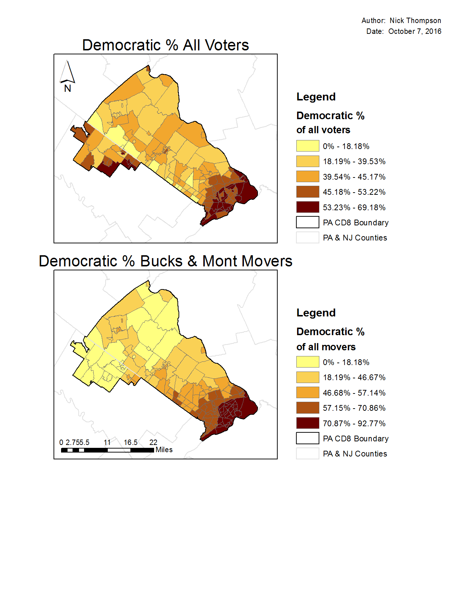

```{r setup, include=FALSE}
knitr::opts_chunk$set(echo = TRUE)
```

The following coverages can be found in the PACD8 folder.

1.  PA_CD8_Voterfile $=$ all registered voters for Pennsylvania, Congressional District 8.  This is north-suburban Philadelphia, including all of Bucks and part of Montgomery Counties.

2.  PA_CD8_Boundary $=$ the outline for CD 8.

3.  PA_and_NJ_Counties $=$ County boundaries for the two states.

4.  Four States = State boundaries for PA, DE, NJ, and MD.

5.  CD8_PA_Pct_Data_2012 $=$ voter precinct data for 2012.

6.  Mont_County_Recent_Movers_10_12.

7.  Bucks_County_Recent_Movers_10_12.

8.  CD8_Places.

9.  PA CD8_Tracts.

Three files above contain points for voters at their residences.  These are 1, 6, and 7.  For these files, the following columns contain important information:

Age (and Year Born) $=$ the age of the voter in 2012.

Rep_Party, Dem_Party, Ind_Unaf_Party $=$ the party registration of the voter:  Rep $=$ Republican, Dem $=$ Democratic, and Ind_Unaf $=$ Independent/Unaffiliated.

And there are other items that will be less important for this exercise.

-----

For the following questions, use whatever tools you deem appropriate form the ArcGIS package, but be sure to describe what you did to address the questions.  Be resourceful, but you need not write more than one page in response to each question.

1.  Aggregate the voter and mover data to the census tract level for PA CD8.

&nbsp;&nbsp;&nbsp;&nbsp;&nbsp;&nbsp;<span style="color:navy">To aggregate the data, I used a three phase process with multiple steps in each phase.  In Phase 1, I imported the data using the catalogue in ArcMap.  To import the data I first created a geodatabase file named `exam`.  Here I imported all exam shapefiled included in the provided exam folder by right clicking on the `exam.gdb` and selecting import from multiple.  Next I systemtaically added four file layers to the ArcMap table of contents:  </span>

&nbsp;&nbsp;&nbsp;&nbsp;&nbsp;&nbsp;<span style="color:navy">a.  PA_CD8_Voterfile (hereafter depicted as `voter`); </span>

&nbsp;&nbsp;&nbsp;&nbsp;&nbsp;&nbsp;<span style="color:navy">b.  Mont_County_Recent_Movers_10_12 (hereafter depicted as `MC`); </span>

&nbsp;&nbsp;&nbsp;&nbsp;&nbsp;&nbsp;<span style="color:navy">c.  Buck_County_Recent_Movers_10_12 (hereafter depicted as `BC`); </span>

&nbsp;&nbsp;&nbsp;&nbsp;&nbsp;&nbsp;<span style="color:navy">d.  PA_CD8_Tracts (hereafter depicted as `tracts`).  </span>

<span style="color:navy">This was the end of Phase 1. </span>

&nbsp;&nbsp;&nbsp;&nbsp;&nbsp;&nbsp;<span style="color:navy">In Phase 2, I reviewed the data and deleted unnecessary fields.  The number is too great to depict which were removed.  I kept essential fields outlined in the instructions above, as well as some others that I anticipated would be necessary (including `MOVER` from the `voter` file, `ozipcode` and `dzipcode` from `MC` and `BC`, and `ORNIC`, `DRNIC`, and `RNIC` from `voter`, `BC`, and `MC`).  The combination of fields chosen allowed me to manipulate the data to achieve the desired results.  I removed fields by double-clicking on each layer in the table of contents and navigating to the `Fields` tab.  After clearing all of the fields, I was able to check only the fields I wanted to keep.  Next, I exported the data into new layers within the geodatabase.  This data management process ended Phase 2. </span>

&nbsp;&nbsp;&nbsp;&nbsp;&nbsp;&nbsp;<span style="color:navy">In Phase 3, I used the `Spatial Join` feature (hereafter known as `SJ`) to systemtaically join the layers.  First I conducted a `SJ` of `voters` to `tracts` and created a new layer called `tracts05`.  Next I created the following `SJ`s: </span>

&nbsp;&nbsp;&nbsp;&nbsp;&nbsp;&nbsp;<span style="color:navy">a.  `BC` $+$ `tracts` $=$ `tracts04` </span>

&nbsp;&nbsp;&nbsp;&nbsp;&nbsp;&nbsp;<span style="color:navy">b.  `MC` $+$ `tracts` $=$ `tracts06` </span>

&nbsp;&nbsp;&nbsp;&nbsp;&nbsp;&nbsp;<span style="color:navy">c.  `tracts05` $+$ `tracts04` $=$ `tracts09` </span>

&nbsp;&nbsp;&nbsp;&nbsp;&nbsp;&nbsp;<span style="color:navy">d.  `tracts09` $+$ `tracts06` $=$ `tracts15` </span>

<span style="color:navy">The last combination created a spatially joined dataset depicting the north-suburban part of Philadelphia.</span>

+ Then compute and calculate the Democratic $\%$ of total registered voters (10 points).

<span style="color:navy">To compute and calculate the Democratic $\%$ of total registered voters I needed to create a new field in the `BC` and `MC` shapefiles.  I completed these computations prior to merging all of the data to ensure that they were carried over in each of the `SJ`s.  First, I created a new field called `vote_total`.  Using the field calculator tool, I added the `Republican`, `Democratic`, and `Independent` fields together.  This produced a one in each row of the `vote_total`.  Next, I used the statistics tool to calculate the total sum of from the `Democratic` field and the the sum from the `vote_total` fields.  I conducted statistical analysis before and after conducting the joins.  The Table 1 below shows the outcomes.  Note there is no significant difference in the percentages either pre- or post-join.</span>


\begin{table}[]
\centering
\caption{Percentage of Democratic Voters}
\begin{tabular}{lll}
Field       & Pre-Join & Post-Join \\
\hline
Democratic  & 71,048   & 133,467   \\
vote\_total & 540,451  & 1,019,887 \\
\hline
\hline
Percentages & 53.23 \% & 52.99 \% 
\end{tabular}
\end{table}

+  Compute and calculate the Democratic $\%$ of total movers in Bucks and Montgomery counties (10 points).

<span style="color:navy">To calculate the percentage of democratic movers I created two fields in `BC` and `MC` once callde `zip_dif` and another called `move2`.  The `zip_dif` field captured a difference between the originating zip code (`ozipcode`) of each voter in the respective counties and the destination zip code (`dzipcode`).  Next, a phython code converted the `zip_dif` field into a $1$ or a $0$.  This allowed me to total the number of people that moved from one zip code to another.  Table 2 shows the results of this computation.  

```{r python code, eval=FALSE}
def is_positive(x):
  if (abs(x)>0):
	return 1
  elif (abs(x)==0):
	return 0 
```

\begin{table}[]
\centering
\caption{Percentage of Democratic Movers}
\label{my-label}
\begin{tabular}{llll}
Field       & Montgomery & Bucks    & Sum      \\
\hline
Democratic  & 2,016      & 22,555   & 24,571   \\
move\_total & 4,620      & 42,040   & 46,660   \\
Percentages & 43.63 \%   & 53.65 \% & 52.66 \%
\end{tabular}
\end{table}

+  Produce two maps of these percentages.

