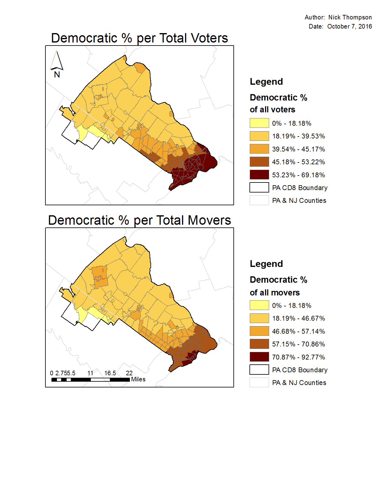
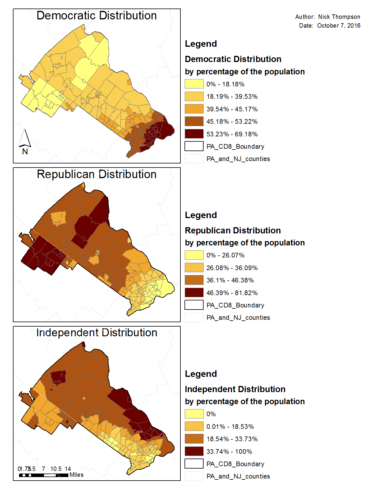
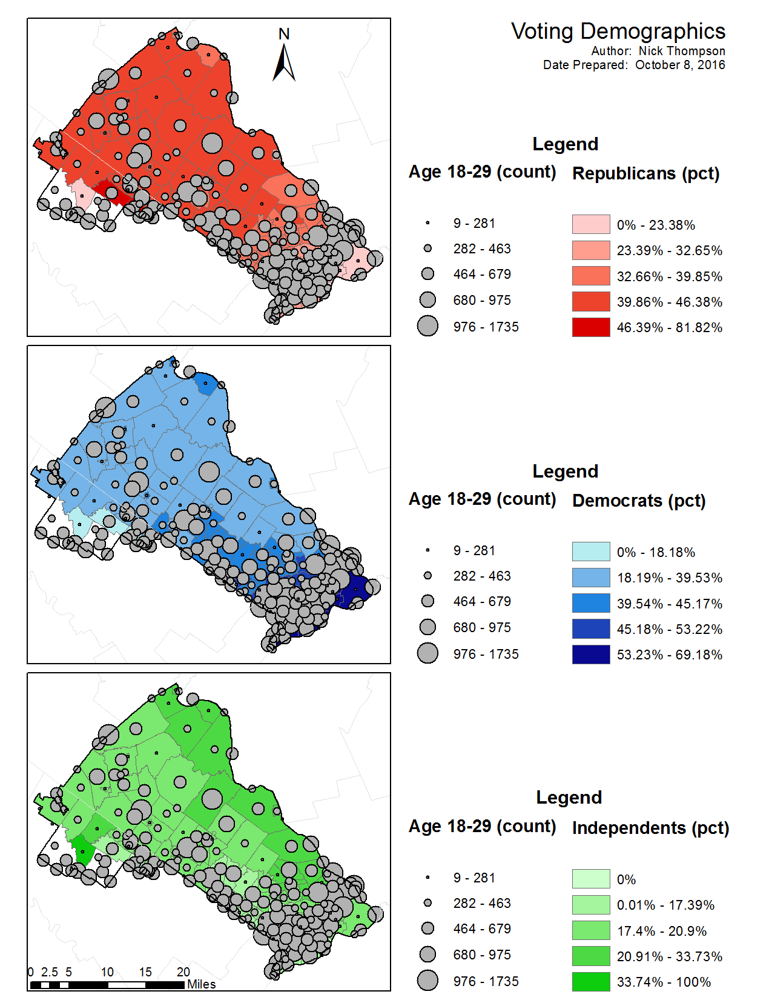
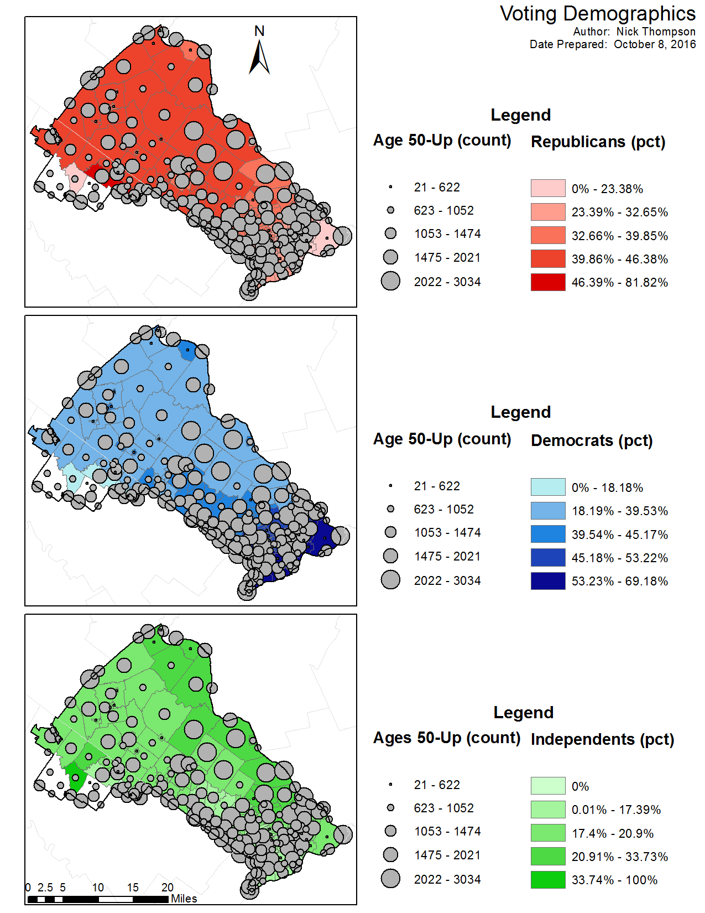

```{r setup, include=FALSE}
knitr::opts_chunk$set(echo = TRUE)
```

The following coverages can be found in the PACD8 folder.

1.  PA_CD8_Voterfile $=$ all registered voters for Pennsylvania, Congressional District 8.  This is north-suburban Philadelphia, including all of Bucks and part of Montgomery Counties.

2.  PA_CD8_Boundary $=$ the outline for CD 8.

3.  PA_and_NJ_Counties $=$ County boundaries for the two states.

4.  Four States = State boundaries for PA, DE, NJ, and MD.

5.  CD8_PA_Pct_Data_2012 $=$ voter precinct data for 2012.

6.  Mont_County_Recent_Movers_10_12.

7.  Bucks_County_Recent_Movers_10_12.

8.  CD8_Places.

9.  PA CD8_Tracts.

Three files above contain points for voters at their residences.  These are 1, 6, and 7.  For these files, the following columns contain important information:

Age (and Year Born) $=$ the age of the voter in 2012.

Rep_Party, Dem_Party, Ind_Unaf_Party $=$ the party registration of the voter:  Rep $=$ Republican, Dem $=$ Democratic, and Ind_Unaf $=$ Independent/Unaffiliated.

And there are other items that will be less important for this exercise.

-----

For the following questions, use whatever tools you deem appropriate form the ArcGIS package, but be sure to describe what you did to address the questions.  Be resourceful, but you need not write more than one page in response to each question.

1.  Aggregate the voter and mover data to the census tract level for PA CD8.

&nbsp;&nbsp;&nbsp;&nbsp;&nbsp;&nbsp;<span style="color:navy">To aggregate the data, I used a three phase process with multiple steps in each phase.  In Phase 1, I imported the data using the catalogue in ArcMap.  To import the data I first created a geodatabase file named `exam`.  Here I imported all exam shapefiled included in the provided exam folder by right clicking on the `exam.gdb` and selecting import from multiple.  Next I systemtaically added four file layers to the ArcMap table of contents:  </span>

&nbsp;&nbsp;&nbsp;&nbsp;&nbsp;&nbsp;<span style="color:navy">a.  PA_CD8_Voterfile (hereafter depicted as `voter`); </span>

&nbsp;&nbsp;&nbsp;&nbsp;&nbsp;&nbsp;<span style="color:navy">b.  Mont_County_Recent_Movers_10_12 (hereafter depicted as `MC`); </span>

&nbsp;&nbsp;&nbsp;&nbsp;&nbsp;&nbsp;<span style="color:navy">c.  Buck_County_Recent_Movers_10_12 (hereafter depicted as `BC`); </span>

&nbsp;&nbsp;&nbsp;&nbsp;&nbsp;&nbsp;<span style="color:navy">d.  PA_CD8_Tracts (hereafter depicted as `tracts`).  </span>

<span style="color:navy">This was the end of Phase 1. </span>

&nbsp;&nbsp;&nbsp;&nbsp;&nbsp;&nbsp;<span style="color:navy">In Phase 2, I reviewed the data and deleted unnecessary fields.  The number is too great to depict which were removed.  I kept essential fields outlined in the instructions above, as well as some others that I anticipated would be necessary (including `MOVER` from the `voter` file, `ozipcode` and `dzipcode` from `MC` and `BC`, and `ORNIC`, `DRNIC`, and `RNIC` from `voter`, `BC`, and `MC`).  The combination of fields chosen allowed me to manipulate the data to achieve the desired results.  I removed fields by double-clicking on each layer in the table of contents and navigating to the `Fields` tab.  After clearing all of the fields, I was able to check only the fields I wanted to keep.  Next, I exported the data into new layers within the geodatabase.  This data management process ended Phase 2. </span>

&nbsp;&nbsp;&nbsp;&nbsp;&nbsp;&nbsp;<span style="color:navy">In Phase 3, I used the `Spatial Join` feature (hereafter known as `SJ`) to systemtaically join the layers.  First I conducted a `SJ` of `voters` to `tracts` and created a new layer called `tracts01`.  Next I created the following `SJ`s: </span>

&nbsp;&nbsp;&nbsp;&nbsp;&nbsp;&nbsp;<span style="color:navy">a.  `tracts` $+$ `BC` $=$ `tracts02` </span>

&nbsp;&nbsp;&nbsp;&nbsp;&nbsp;&nbsp;<span style="color:navy">b.  `tracts` $+$ `MC` $=$ `tracts04` </span>

&nbsp;&nbsp;&nbsp;&nbsp;&nbsp;&nbsp;<span style="color:navy">c.  `tracts01` $+$ `tracts02` $=$ `tracts03` </span>

&nbsp;&nbsp;&nbsp;&nbsp;&nbsp;&nbsp;<span style="color:navy">d.  `tracts03` $+$ `tracts04` $=$ `tracts07` </span>

<span style="color:navy">The last combination created a spatially joined dataset depicting the north-suburban part of Philadelphia.</span>

+ Then compute and calculate the Democratic $\%$ of total registered voters (10 points).

<span style="color:navy">To compute and calculate the Democratic $\%$ of total registered voters I needed to create a new field in the `BC` and `MC` shapefiles.  I completed these computations prior to merging all of the data to ensure that they were carried over in each of the `SJ`s.  First, I created a new field called `vote_total`.  Using the field calculator tool, I added the `Republican`, `Democratic`, and `Independent` fields together.  This produced a one in each row of the `vote_total`.  Next, I used the statistics tool to calculate the total sum of from the `Democratic` field and the the sum from the `vote_total` fields.  I conducted statistical analysis before and after conducting the joins.  The Table 1 below shows the outcomes.  Note there is no significant difference in the percentages either pre- or post-join.</span>

\begin{table}[]
\centering
\caption{Percentage of Democratic Voters}
\begin{tabular}{ccc}
Field       & Pre-Join & Post-Join \\
\hline
Democratic  & 71,048   & 133,467   \\
vote\_total & 540,451  & 1,019,887 \\
\hline
\hline
Percentages & 53.23 \% & 52.99 \% 
\end{tabular}
\end{table}

+  Compute and calculate the Democratic $\%$ of total movers in Bucks and Montgomery counties (10 points).

<span style="color:navy">To calculate the percentage of democratic movers I created two fields in `BC` and `MC` once callde `zip_dif` and another called `move2`.  The `zip_dif` field captured a difference between the originating zip code (`ozipcode`) of each voter in the respective counties and the destination zip code (`dzipcode`).  Next, a phython code converted the `zip_dif` field into a $1$ or a $0$.  This allowed me to total the number of people that moved from one zip code to another.  Table 2 shows the results of this computation.  

```{r python code, eval=FALSE}
def is_positive(x):
  if (abs(x)>0):
	return 1
  elif (abs(x)==0):
	return 0 
```

\begin{table}[]
\centering
\caption{Percentage of Democratic Movers}
\label{my-label}
\begin{tabular}{cccc}
Field       & Montgomery & Bucks    & Sum      \\
\hline
Democratic  & 2,016      & 22,555   & 24,571   \\
move\_total & 4,620      & 42,040   & 46,660   \\
\hline
\hline
Percentages & 43.63 \%   & 53.65 \% & 52.66 \%
\end{tabular}
\end{table}

+  Produce two maps of these percentages.

To produce my maps I followed some formatting guidelines.  First, I always included a legend, scale, and north seeking arrow.  Also included was my name as the author and the date I finalized the map.  For this first set of maps I normalized the `Sum_Sum_Democratic` variable over the `Sum_Sum_vote_total` for the first map (as labeled in Figure 1).  I normalized the `Sum_Sum_Democratic` variable over the `Sum_Sum_vote_total` variable for the second requirement.  

This depicts a strong concentration of Democratic voters located in the southeastern portion of the country.  Democratic voters show a propensity for migration with a large percentage moving in and around the southeastern portion of the county.  

Note that this data does not reflect the `MOVER` field from the `MC` dataset.  The `MOVER` variable was not used because it was only available in the `MC` dataset and only depicted a small swath of migration running from northwest to southeast along the southwestern third of the county.  All map figures will be available in the Appendix.


[comment]:  This is where Figure 1 would have gone.


2.  How would you characterize the spatial distribution of Republicans, Democrats, and Independents in PA CD8?  Write up two paragraphs based on what you have found, describing how you used ArcGIS to address the question.  (20 points)

Democrats, by and large, tend to be located in the south eastern part of the map (which is northern Philadelphia).  Republicans are a significantly lesser amount of the population and tend to inhabit the norther part of the voting district, with a concentration in the center of Montgomery county in the southwest.  Independents show similar patterns to the Republicans but on a much smaller scale.

I used a percentage of total voters for each party and compared them to one another, as depicted in Figure 2.  This distribution by percentage was calculated using the `Sum_Sum_Democrat`, `Sum_Sum_Republican` and `Sum_Sum_Independent` variables normalized by `Sum_Sum_vote_total` variable.  I utilized a five quantile break.


[//]: This is where Figure 2 woud have gone.

3.  The data included also show two populations of recent movers from inside PA and from nearby states.  How do the recent movers in Montogomery and Bucks counties compare by age and by party registration to the entire PA_CD8 voting populations?  Explain your answer in no more than one page.

To answer this question I pulled the descriptive statistics for each dataset (`BC`, `MC`, `voter`) and collected the number of people that voted in each party, the party means, and the party standard deviations (Table 3).  I also collected the mean, standard deviation, minimum, and maximum values of the voters from each of the three datasets (Table 4).

 The Montgomery county movers are represented by a higher percentage of Republicans than Democrats (Independents are behing Republicans and Democrats in all three datasets.  The Bucks county Democratic movers ($46.10\%$) have a significantly higher percentage than Montgomery county movers ($37.68\%$).  This indicates that either Democrats in Bucks county are migrating at higher rates, or that the percentage of voters in both counties falls around those means.
 
 One way to differentiate between the two possibilities is to compare the means of the total voter population from the district.  If we assume a normal distribution of Republican, Democratic, and Independent voters throughout the district then the averages of $34.13\%$ for Republicans, $52.63\%$ for Democratic party voters, and $12.10\%$ for Independent voters should represent similar means the two counties.  
 
 The Republican numbers in Bucks county are close to the overall voter mean, but the Montgomery mean is higher.  This indicates that Republicans are migrating to Montgomery county.  The mean of Democratic voters in both Bucks and Montgomery counties is significantly lower than in the `voter` database.  This may indicate less migration for Democratic voters.
 
 The age demographics do not tell us as much without a geographic dispersion.  The mean and standard deviation of the three data sets is relatively similar, as depicted in Table 4.  As depicted in Figures 3-5, the age dispersion.  
 
 In order to complete the maps I combined a choropleth map of each party (red for Repubulican, blue for Democrat, green for Independent) with a centroid map of the overall voting population.  This normalized the regiserted voters by each age group.  While the ages look identical in each map, the scales of the circles are different.  Note the low numbers of 18-29 year old voters in comparison to 30-49 year olds.
 
 To create the centroid maps I followed this sequence.  First I created XY coordinate for each dataset by adding a new X and Y field respectively.  Next using the "Calculate Gemoetry" function for each X and Y respecitvely.  Next, I joined the `tracts` map with the `BC`, `MC`, and `voter` data sets.  Then I exported the joined tract datasets to a `tractCentroids` table.  This table now had the centroids for each voting block.  
 
 To finalize the method I created a feature class from the XY `tractCentroids` table.  Opening the cataloge in ArcMap, I right clicked on `trackCentroids` and clicked "Create Feature Class" > "From XY Table".  I make the coordinate system the same as all of my other maps, the South Pennsylvania 1984.  Finally, I saved the file as a File and Personal Geodatabase called `voterTractCentroids`.


\begin{table}[]
\centering
\caption{Descriptive Statistics by Party}
\label{my-label}
\begin{tabular}{ccccc}
Dataset    & Party       & Vote Totals & Mean   & Std\_Dev \\ \hline
Montgomery & Republican  & 2230         & 0.4167 & 0.4930    \\
Montgomery & Democratic  & 2016         & 0.3768 & 0.4845   \\
Montgomery & Independent & 1043         & 0.1949 & 0.3962   \\ \hline
Bucks      & Republican  & 16808        & 0.3436 & 0.4748   \\
Bucks      & Democratic  & 22555        & 0.461  & 0.4984   \\
Bucks      & Independent & 8979         & 0.1835 & 0.3871   \\ \hline
Voter      & Republican  & 46085        & 0.3413 & 0.4742   \\
Voter      & Democratic  & 71048        & 0.5263 & 0.4993   \\
Voter      & Independent & 16334        & 0.121  & 0.3261  \\ \hline \hline
\end{tabular}
\end{table}


\begin{table}[]
\centering
\caption{Descriptive Statistics by Age}
\label{my-label}
\begin{tabular}{lllll}
\multicolumn{1}{c}{Data Set} & \multicolumn{1}{c}{Mean} & \multicolumn{1}{c}{\begin{tabular}[c]{@{}c@{}}Standard \\ Deviation\end{tabular}} & \multicolumn{1}{c}{Min} & \multicolumn{1}{c}{Max} \\ \hline
Montgomery                   & 43.81                    & 16.73                                                                             & 20                      & 104                     \\
Bucks                        & 44.83                    & 15.99                                                                             & 20                      & 104                     \\
Voter Data                   & 49.57                    & 17.50                                                                             & 0                       & 112                    \\ 
\hline 
\hline
\end{tabular}
\end{table}

\clearpage

4.  Are movers more likely to relocate to particular locations than the general voter populations within PA CD8?  Or are they geoographically distributed about the same way?  Explain what you find in no more than one page.

Based upon the analysis form the maps generated in Figures 3-5, the propensity for 

# Appendix







